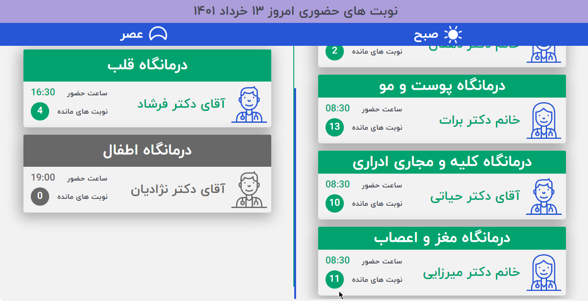

## وَكَانَ فَضْلُ اللَّهِ عَلَيْكَ عَظِيمًا - 113 سورة النساء

# Physicians

An application to show the physicians schedule on TV

## Description

An app to show doctors' programs on TV. This app is completely online and web based. I tried to design this app as optimally as possible. This means that the program uses the TV screen efficiently. 

Being real-time was another challenge. I used Websockets to connect the server to the client. Therefore, there is no need to fetch data over a period of time.

## Getting Started

## Tech Stack

<div align="center">
<a href="https://reactjs.org/" title="React"></a>
<a href="https://sass-lang.com/" title="Typescript"></a>
<a href="https://www.typescriptlang.org/" title="SASS"></a>
<a href="https://git-scm.com/" title="Git"></a>
<a href="https://yarnpkg.com/" title="Yarn"></a>
<a href="https://eslint.org/" title="ESLint"></a>
<a href="https://prettier.io/" title="Prettier"></a>
<a href="https://testing-library.com/docs/react-testing-library/intro/" title="React-Testing-Library"></a>
<a href="https://code.visualstudio.com/" title="Visual Studio Code"></a>
</div>

## Overview


## Demo

### Live Demo

No live demo

### Demo photos




## Styles and Design system

Just SASS.

### Installing Dependencies

```
npm install
```

```
yarn
```

### Build & Run

```
npm run build
npm start
```

```
yarn build
yarn start
```

#### Tests

- Unit/Integration Test
  - Run `yarn test` to execute the unit tests.

## Help

In case of any issues please reach out to me at: info@khaledr.ir

## Authors

[Khaled Rakhisi](https://www.linkedin.com/in/khaledrakhisi/)

## License

This project is licensed under the [Khaled Rakhisi] License - see the LICENSE.md file for details

## Acknowledgments

Inspiration, code snippets, etc.

- [awesome-readme](https://github.com/matiassingers/awesome-readme)
- [PurpleBooth](https://gist.github.com/PurpleBooth/109311bb0361f32d87a2)
- [dbader](https://github.com/dbader/readme-template)
- [zenorocha](https://gist.github.com/zenorocha/4526327)
- [fvcproductions](https://gist.github.com/fvcproductions/1bfc2d4aecb01a834b46)
